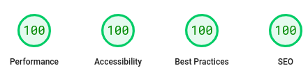

# Los Pampa site

Este é o repositório do site da Los Pampa.

Feito com:

- [Astro](https://astro.build/), utilizando o template para blog como base.
- [Tailwind CSS](https://tailwindcss.com/)



## Como criar um projeto no site

### Informações gerais

A URL de um projeto específico é baseado no nome de seu arquivo.

Por exemplo, se o arquivo é chamado `exemplo.md`, a URL do projeto será `/projetos/exemplo`.

Comece sempre com o segundo nível de cabeçalho. Pois o primeiro será o título do projeto.

### Todos os recursos de markdown estão disponíveis

Para mais informações de como utilizar markdown, você pode utilizar o [**cheat sheet**](https://www.markdownguide.org/cheat-sheet/) ou, se quiser ler a [**documentação completa**](https://www.markdownguide.org).

### Front Matter

O Front Matter é a parte do arquivo que contém informações sobre o projeto. Ele é delimitado por `---` no início e no final do arquivo. _title_, _description_ são campos obrigatórios, _externalLinks_ e _heroImage_ são opcionais.

- title: Este é o título do projeto. Ele é usado na lista de projetos e na página do projeto.

- description: Esta é uma breve descrição do projeto. É útil para fornecer uma visão geral rápida do conteúdo do projeto. A descrição é usada na lista de projetos e logo embaixo do título do projeto em sua página.

- externalLinks (opcional): Este campo pode conter links externos relevantes para o projeto, como outros sites, ou redes socias. Este campo é opcional e pode ou não ser incluído, dependendo das necessidades do projeto. A tipagem de externalLinks é a seguinte:

```javascript
ExternalLinks = {
	name: string;
	url: string;
};
```

Onde `name` é o nome do link e `url` é o endereço do link.

Temos ícones para as seguintes tipos de links externos: `app-store`, `discord`, `facebook`, `github`, `gitlab`, `instagram`, `play-store`.

- heroImage (opcional): Este campo pode conter uma imagem que será exibida no cabeçalho da página do projeto. A imagem deve ser hospedada no site e o caminho para a imagem deve ser fornecido. Este campo é opcional e pode ou não ser incluído, dependendo das necessidades do projeto.
